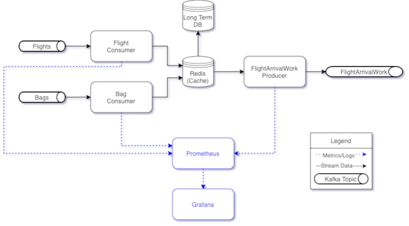
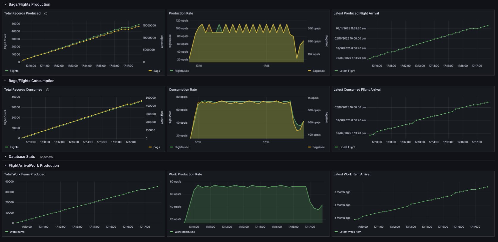

# Flight Baggage Tracking System

A distributed system for tracking baggage across multiple flights, built with Python, Kafka, Redis, and modern observability tools.

# Warning

This project is a work in progress and is not ready for production use. I'm fairly confident there are bugs. This was put together very quickly to prove out my design.

## System Architecture



### Flight Consumer
- Consumes flight data from Kafka topic 'flights'
- Stores flight data in Redis using hash structures
- Maintains a sorted set of flight arrival times for efficiently finding flights arriving within the next 10 minutes.
- Metrics:
  - Total flights processed
  - Flight consumption rate
  - Latest flight arrival timestamp

### Bag Consumer
- Consumes bag data from Kafka topic 'bags'
- Stores bag itineraries in Redis
- Metrics:
  - Total bags processed
  - Bag consumption rate

### Arriving Flight Work Producer
- Identifies flights arriving within the next 10 minutes
- For each arriving flight:
  - Lists all bags on the flight
  - Determines next departure time for each bag
    - Departure time = 0 if the bag is at it's final destination
    - Departure time = -1 if the bag's itinerary doesn't exist in Redis yet.
    - Departure time = -2 if the bag has no flights
    - Departure time = -3 if the next flight in the bag's itinerary doesn't exist in Redis yet.
    - Departure time = >0 if the bag will be departing on another flight.
  - Publishes work items to 'arriving_flight_work' Kafka topic
- Metrics:
  - Work items produced
  - Work production rate
  - Latest work item timestamp
  - Current Redis flight/bag counts

### Redis
- Redis is an in-memory single-threaded database. We only want to keep data here that's recent. This implementation doesn't include a long-term database, but if implemented in production, logic should be added to move old data to a more persistent database.
- The Flight and Bag Consumers perform batch updates/inserts (aka "upserts") to Redis by running Lua scripts on the Redis instance.
- The Arriving Flight Work Producer also runs a Lua script to get the work items for the arriving flights.
- While a Lua script is running, Redis will block any other operations from being performed on the instance. This helps us avoid race conditions, but could introduce issues with scaling at some point.

## Local Dashboard



The above dashboard shows the following:

- The first row shows the flights and bags produced to the data streams. Arrival data is generated for a 24-hour period starting 2 minutes from now. 1000 flights and 300,000 bags are produced for each hour.
- The second row shows the bags and flights that are consumed from the data streams and inserted into Redis.
- The third row shows FlightArrivalWork being produced. The image shows us producing

This dashboard shows us producing about 240,000 work items per hour (which is 240x the number of flights).

#### Redis Data Structures

##### Flights
- Key pattern: `flight:id:<flight_id>`
- Type: Hash
- Fields:
  - departure_time: Unix timestamp
  - arrival_time: Unix timestamp
  - bags: JSON array of bag IDs

##### Flight Indexes
- Key pattern: `flight:arrival_times`
- Type: Sorted Set
- Score: arrival timestamp
- Members: flight IDs
- Used for efficient querying of upcoming arrivals

##### Bags
- Key pattern: `bag:id:<bag_id>`
- Type: Hash
- Fields:
  - flights: JSON array of flight IDs in order

##### Counters
- Key pattern: `flight:count` and `bag:count`
- Type: String (integer)
- Tracks total number of flights/bags

## Test Data Generation

### Test Producers Application
- Generates semi-realistic test data:
  - Flights: Random departure/arrival times
  - Bags: Random itineraries across multiple flights
- Publishes to Kafka topics:
  - 'flights': Flight schedule data
  - 'bags': Bag routing data
- Configurable volume and time windows
- Metrics for monitoring data generation

## Observability Stack

### Prometheus
- Scrapes metrics from all applications
- Stores time-series data
- Enables querying and alerting
- Default port: 9090

### Grafana
- Visualizes metrics from Prometheus
- Pre-configured dashboards for:
  - Message processing rates
  - System latencies
  - Redis statistics
- Default port: 3000

### Logging
- JSON-formatted logs
- Timestamp and service identification
- Error tracking and debugging
- Viewable through Docker logs

## Infrastructure

### Kafka
- Message broker for system events
- Topics:
  - flights: Flight schedule updates
  - bags: Bag routing information
  - arriving_flight_work: Work items for arriving flights
- Enables scalable, reliable message delivery

### Redis
- In-memory data store
- Lua scripting for atomic operations
- Efficient querying with sorted sets
- Redis Commander UI (port 8081)

### Docker
- Containerized applications
- docker-compose for local deployment
- Health checks and automatic restarts
- Easy scaling and management

## Metrics and Monitoring

### Application Metrics
- Message processing rates
- Processing latencies
- Error counts
- Redis operation timing
- System resource usage

### Grafana Dashboards
- Real-time system overview
- Historical performance data
- Error rate monitoring
- Redis memory usage
- Message queue depths

## Development

### Requirements
- Docker and docker-compose

### Running the System

1. Start the system:
   ```bash
   docker-compose up -d
   ```

2. Stop the system:
   ```bash
   docker-compose down
   ```

3. Check the logs:
   ```bash
   docker-compose logs -f
   ```

### Access UIs

- Grafana: http://localhost:3000
- Prometheus: http://localhost:9090
- Redis Commander: http://localhost:8081

### Scaling Improvements

1. Add a long-term database to store bag/flight information.
2. Add a job to delete old data from Redis.
3. Use multiple partitions on the datastreams to facilitate higher throughput.
4. Use multiple replicas for each application to facilitate higher throughput.
5. Use a redis cluster with multiple read nodes to facilitate higher throughput.
    - This would introduce race conditions in our data. We could lock bits of logic to fix these race conditions.
